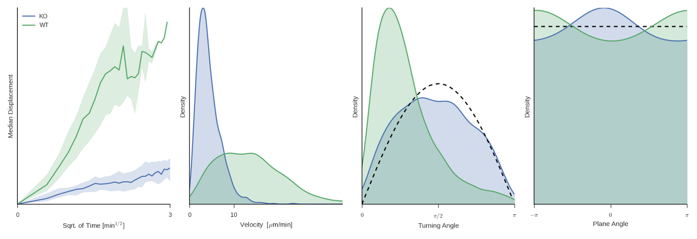

lana
====

A toolbox to analyze lymphocyte tracks within lymphnodes from microscopy or simulations. It is based on [Pandas](http://pandas.pydata.org/), [numpy](http://www.numpy.org/), [matplotlib](http://matplotlib.org/), [seaborn](http://web.stanford.edu/~mwaskom/software/seaborn/), [statsmodels](http://statsmodels.sourceforge.net/), [scikit-learn](http://scikit-learn.org/) and [scikit-image](http://scikit-image.org/) and produces figures like the following motility analysis:

Modules
-------
  * **motility.py**: Tools to analyze cell motility from positions within lymph nodes. Handles data from experiments or simulations and plots the analaysis.
  * **remix.py**: Statistical models to generate tracks based on data.
  * **contacts.py**: Identify contacts between T cells and dendritic cells.
  * **excalib2.py**: Wrapper to configure, run and analyze excalib2 cellular Potts model simulations. Includes functions to run parameter sweeps or compare different commands.
  * **imaris.py**: Loads cell tracks from excel spreadsheets exported from [Imaris](http://www.bitplane.com/imaris/imaris).
  * **volocity.py**: Loads [Volocity](http://www.perkinelmer.co.uk/volocity) cell tracks.
  * **spim.py**: Displays and finds cells in SPIM (Single Plane Illumination Microscopy) data.

To install the required packages run `$ pip install -r requirements.txt`, for usage see the examples in `if __name__ == '__main__'` in the corresponding module.
