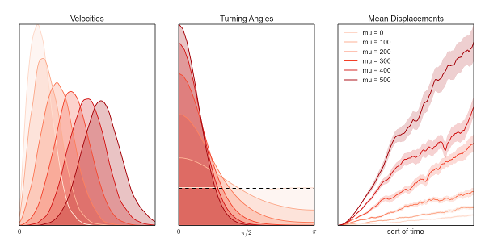

lana
====

A toolbox to analyze lymphocyte tracks within lymphnodes from microscopy or simulations based on [numpy](http://www.numpy.org/), [matplotlib](http://matplotlib.org/) and [seaborn](http://web.stanford.edu/~mwaskom/software/seaborn/).

Modules
-------
  * **lana.py**: Tools to analyze cell motility from positions within lymph nodes. Handles data from experiments or simulations and plots the analaysis.
  * **excalib2.py**: Wrapper to configure, run and analyze excalib2 cellular Potts model simulations. Includes funtions to run parameter sweeps or compare different commands.
